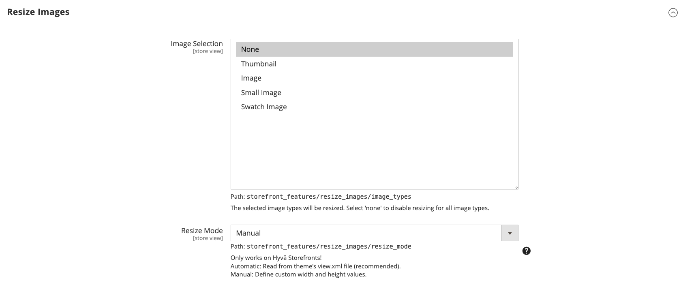
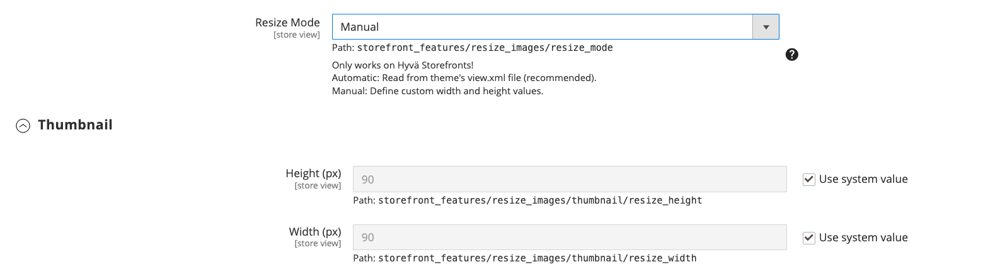
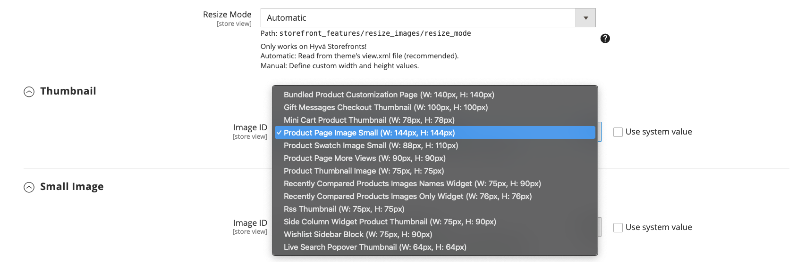

# Basecom_LiveSearchImageUrls Module

<div align="center">

[![Packagist][ico-version]][link-packagist]
[![Software License][ico-license]](LICENSE)
![Supported Magento Versions][ico-compatibility]

</div>

---

When preparing the data for the catalog export to live search, the catalog data export module does not consider the resized, cached files.
Instead, the unchanged source file (selected in the admin area) is used. This has considerable performance implications, because the images are now a lot bigger than they need to be.
Depending on the implementation, this can affect the entire catalog and product listing page, but will in any case affect the search popover.

This module adds a plugin to the `ImageFormatter::format()` method, which correctly resizes the images that are synced to the live search catalog.
This fixes the [issue](https://gitlab.hyva.io/hyva-enterprise/sensei/magento2-ee-magento-live-search/-/issues/9) opened in the Hyva-Enterprise repository
(You may need to be given access to view the issue). 

## Installation

1. Install the module via composer

    ```console
    composer require basecom/magento2-live-search-image-urls
    ```

2. Enable the module

    ```console
    bin/magento module:enable Basecom_LiveSearchImageUrls
    bin/magento setup:upgrade
    ```

## Configuration

The module can be configured under `Stores > Configuration > Live Search > Storefront Features > Resize Images`.
You can select all images types (`thumbnail`, `image`,`smallImage`,`swatchImage`) that you want to be considered for resizing.
Selecting `none` (default value) will overrule any selections and no resizing will take effect.



### Resize Mode

There are two available resize modes:

**Manual**:

Allows you to manually configure the width and height dimensions of each image.




**Automatic** (default):

Select an image id from the defined images in the `view.xml` file. The images are taken from the theme that is configured for the default store view.
This approach is recommended, as you avoid duplication and unnecessary resizing of additional dimensions.



## Testing

Please test this functionality locally or on your staging system, before using it in production.

1. Reset the `catalog_data_exporter_products` index, as it might be occupied by another process.

    ```console
    bin/magento indexer:reset catalog_data_exporter_products
    ```
   
2. Initiate a partial reindex.

    ```console
    bin/magento indexer:reindex catalog_data_exporter_products
    ```
   
As the `catalog_data_exporter_products` index depends on others, this will reindex the following indexers as well:
* `catalog_category_product`
* `catalog_product_category`
* `cataloginventory_stock`

After the reindex has finished, it may take some time for Live Search to sync the data. If you want to immediately verify if the generated url is correct,
you could add a `dump($result['thumbnail']['url']);` statement to the `afterFormat()` function before returning.

> [!NOTE]
> Please make sure that the selected placeholder image for the thumbnail and smaller images is already correctly resized. Resizing this image programmatically may lead to incorrect results.
> You can change it under `Stores > Configuration > Catalog > Catalog > Product Image Placeholders > Thumbnail`.

## Contributing

Please see [CONTRIBUTING](CONTRIBUTING.md) for details.

## Security

If you discover any security related issues, please email <magento@basecom.de> instead of using the issue tracker.

## License

Licensed under the [MIT](LICENSE) license.

## Copyright

basecom GmbH & Co. KG

[ico-version]: https://img.shields.io/packagist/v/basecom/magento2-live-search-image-urls.svg?style=flat-square

[ico-license]: https://img.shields.io/badge/license-MIT-brightgreen.svg?style=flat-square

[ico-compatibility]: https://img.shields.io/badge/magento-2.4-brightgreen.svg?logo=magento&longCache=true&style=flat-square

[link-packagist]: https://packagist.org/packages/basecom/magento2-live-search-image-urls
